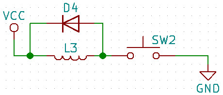

# Hacking hardware

Val di susa

---
class: center, middle
## Intro

---

class: center, middle
### Basic electronics

---

#### Storia

---

#### Corrente, voltaggio e potenza

Le due grandezze fondamentali per un circuito sono **Ampere** e **Volt**.

Gli ampere misurano il numero di cariche (elettroni) in unità di tempo che passano
in una sezione di un conduttore.

Il voltaggio (che nella pratica è sempre una differenza fra due valori, per questo
gli strumenti hanno due sonde) è l'energia necessaria a spostare una carica.

Proprio perché si necessitano due valori, uno viene chiamato **terra** (**ground**) e
indicato come GND, non tutti i GND nascono uguali! se due circuiti devono comunicare
**i loro segnali di terra devono essere collegati**.

**Se un apparecchiatura ha un filo che è segnalato come terra, DEVE ESSERE
COLLEGATO A TERRA** fare altrimenti è a vostro rischio e pericolo.

**Fare molta attenzione quando si connettono due dispositivi che abbiano
i voltaggi fra loro compatibili.**

Si chiama **Alternata** la corrente/voltaggio che varia nel tempo (**AC**) e **Continua** (**DC**)
quella costante. Tenere presente che le componenti si comportano diversamente in questi due regimi.

La potenza misurata in **Watt** invece è data da `\(P = IV\)`.

---

#### Segnale

I decibel
`\(dB = 20\log_{10}{A_1\over A_2}\)`

---

#### Batteria

 - How to Make a Coin Battery ([video](https://www.youtube.com/watch?v=vIHfUJu3aKo))

---

#### Cavi e connettori

Figata i pogo pin
SMA, BNC

---

#### Resistenza

È la componente più comune di un circuito: si misura in **Ohm** e permette di definire
la legge omonima (più grande R, più piccola la corrente):

$$
I = {V\over R}
$$

Come si nota se `\(R\to0\)` `\(I\to\infty\)` in tal caso si ha un **corto circuito**. Corto circuito
è male: il fumo che esce dalle componenti è dovuto (anche) a quello.

Le resistenze (ma non solo) hanno un valore di potenza massima ammessa, superato quella
prendono fuoco! Grazie a questo possono essere usate resistenza a zero ohm come
fusibili di emergenza. Altrimenti usare un [termistore](https://it.wikipedia.org/wiki/Termistore)
che ha la resistenza che aumenta con la temperatura.

##### Pull-up e pull-down

---

#### Condensatore

Idealmente è costituito da due piastre parallele con del dielettrico in mezzo. 

Applicando un voltaggio ai capi si ottiene l'immagazzinamento di una carica (e di energia).

La sua _formula_ è `\(I=C{dV\over dt}\)`: in pratica la corrente che passa è data dalla
variazione in unità di tempo del voltaggio ai suoi estremi.

A parte l'utilizzo nei circuiti AC, essi vengono utilizzati come

 - decoupling
 - bypass

---

#### Induttanza

Questo è l'elemento più particolare di quelli lineari: immagazzina energia nel campo magnetico.

La sua formula è `\(V = L{dI\over dt}\)`: il voltaggio ai suoi estremi è dato dalla
variazione della corrente che scorre in esso.

Ricordarsi che ogni elemento non è solo induttanza, condensatore e resistenza,
ma contiene un poco di ognuno.

Gli elementi di cui abbiamo parlato fino ad adesso sono elementi **lineari**,
cioé

---

#### Induttanza bonus

Una piccola cosa che si può fare con questo elemento è **aumentare** il voltaggio:
questo circuito genera un voltaggio di uscita doppio rispetto a quello di ingresso!

Seguendo la **volt/second balance rule** si ha `\(<V> = 0 \)` perciò `\((V_O - V_I) + (0 - V_I) = 0\)`.

Ricordatevi che l'energia si deve conservare ;)

---

#### Pulsanti e interruttori

---

#### Impedenza

La legge di Ohm vale solo per corrente continua, per la corrente alternata si usa una
grandezza più _complicata_ (non è una costante, è una funzione in campo complesso
che dipende dalla frequenze **nei circuiti lineari**). Le impedenze dal punto di vista
matematico sono:

`\(Z_R = R\quad Z_C = j{1\over \omega C}\quad Z_L = j\omega L\)`

Siccome la _parte reale_ è solo resistiva, induttanze e capacitanze
non consumano energia!

 

---

#### Diodi e led

Primo elemento non lineare e **drogato**; in pratica (con dei limiti)
fa passare la corrente solo in una direzione

.center[]

L'**anodo** è 0.6 Volt più positivo del **catodo**. **forward drop voltage**,
negli **zener** invece agisce anche in direzione opposta con un determinato
voltage drop quindi è usato in parti di circuito dove è necessaria una precisa
differenza di voltaggio.

---

#### Voltage regulator

Sono circuiti che regolano il voltaggio ad un determinato livello. Ce ne sono
di diverse tipologie

 
##### Lineari

Possono solo diminuire il voltaggio originale e sono meno efficienti

.center[]

---

#### Voltage regulator bis

##### Switching

Si basano sul _trucchetto_ delle induttanza e quindi possono anche aumentare il
voltaggio originale; sono più efficienti ma rumorosi (il voltaggio contiene delle
piccole variazioni dovute allo switching)

Ce ne sono di due tipologie

  - **Buck:** abbassano
  - **Boost:** alzano

##### Trasformatori

.center[]

---

#### Motori

 - Brushless
 - Stepper

Siccome i motori sono fondamentalmente elementi induttivi, è necessario
mettere sempre un diodo a cavallo 

.center[]

Per usarli si usano gli **H Bridge**.

---

#### Transistor

Componente rivoluzionaria, detto a cazzo è uno **interrutore elettrico** (molto
più veloce, piccolo e senza parti mobili rispetto ad un relay). La sua importanza
è anche nel fatto che amplifica e utilizzato con il feedback permette di costruire
circuiti particolari. Per esempio i voltage regulator lineari sono costruiti
usando il feedback di un transistor per mantenere il più possibile costante
il voltaggio in uscita.

.center[]

Ne esistono di diversi tipi **BJT**, **JFET** e **MOSFET**: i primi lavorano
in corrente e hanno un alto **gain**, i secondi lavorano in voltaggio, hanno
una più alta impedenza di ingresso ma hanno poco gain, per di più instabile.

Una componete che meriterebbe un talk a parte è l'**OpAmp**, praticamente
un transistor on steroid.

È il primo livello di astrazione che porta ai processori.

---

#### Logic gates

##### Livelli logici

Solitamente un voltaggio pari al VCC è logico 1 e GND è valore logico 0
(è possibile anche l'inverso) comunque un dispositivo non emette mai
un segnale ad un valore fisso, quindi esistono dei range.

I voltaggi dei livelli logici possono essere 5V, 3V3, 1V8. Avere un
voltaggio più basso significa avere meno consumo ma è in relazione
alle dimensioni dei transistor (motivo per cui 5V **distrugge** 3V3). 

##### Logica

Il livello successivo sono le porte logiche: implementazioni hardware
di operatori logici

.center[]

---

#### LG combinatori e sequenziali e buffer

Normalmente l'unione di quest porte è detto **combinatorio**: 

.center[]

In certi casi è necessario avere dei circuiti con _memoria_;
tali circuiti sono detti **sequenziali**.

.center[]

---

#### Flip-flop

È il nucleo dei circuiti digitali sequenziali; in questi circuiti il valore di output **Q** viene _salvato_
qualunque valore assume l'input **D**. **Q** viene aggiornato solo ad un ciclo
di clock con il valore di **Q**.

.center[]

 - [What is a flip flop?](https://electronics.stackexchange.com/questions/251642/what-is-a-flip-flop)

---

#### Cristalli&Clock

Come abbiamo visto con i Flip-Flop essi agiscono con un clock, cioé un segnale
ripetuto che deve essere il più regolare possibile.

Esistono vari circuiti che possono generare un segnale ciclico (555, colpitts oscillator)
ma per un motivo o per l'altro sono poco precisi (vuoi margine di errore delle componenti,
vuoi parametri operativi come temperatura).

In natura il quarto è un materiale piezoelettrico e permette di ottenere clock molto precisi
(parti per millione).

---

#### Bus

porcodio

---

#### Processori

---

class: center, middle
### Utensili

---

#### Multimetro

---

#### Saldatore

.center[]
[Video](video/solder-wick.mp4)

---

#### Stagno

**Lead free**, **Lead solder** and **Flux-core solder**

[RoHS](https://en.wikipedia.org/wiki/Restriction_of_Hazardous_Substances_Directive)

---

#### Breadboard

---

#### Piastra millefori

---

#### Oscilloscopio

Attenti ai **ground loop**.

---

#### Logic analyzer

---

class: center, middle
### Protocolli

---

#### Pulse Width Modulation (PWM)

È la cosa più semplice che vi può venire in mente: frequenza fissa e un duty cicle
variabile.

---

#### UART (seriale)

Il modo di comunicare degli antichi (/dev/tty anyone?). Si chiama _seriale_
perché la comunicazione avviene un byte alla volta.

Solitamente usa 2 segnali + GND, è il modo più semplice per avere
un protocollo duplex senza un segnale di clock (condiviso); unico difetto è
che bisogna mettersi d'accordo su il **baud rate**.

Di solito è la prima cosa che uno controlla su un device perché è molto
semplice da trovare, da accedere e in molti casi dà accesso ad una shell
(anche con privilegi).

##### Segnali

 - TX
 - RX
 - DTS
 - CTS

Su alcuni device non c'è un connettore solo per quello ma è accessibile
tramite USB (Samsung) o jack audio (Nexus 5).

---

#### I2C

---

#### SPI

---

#### JTAG

In pratica un protocollo per debuggare dispositivi: permette di fare il single
step sui processori, analizzare la memoria, accedere e agire su flash memory e quant'altro.

Il momento che la trovi è game over per il dispositivo.

Il programma standard per interfacciarsi con questo protocollo è [OpenOCD](http://openocd.org).

##### Segnali

 - TMS
 - TCK
 - TDI
 - TDO
 - TRST (opzionale) Tap reset
 - SRST (opzionale) system reset

##### Links

 - [JTAGEnum](https://github.com/cyphunk/JTAGenum/)
 - [Locating JTAG pins automatically](http://elinux.org/images/d/d6/Jtag.pdf)
 - [The JTAG Interface: AN ATTACKER’S PERSPECTIVE](https://optivstorage.blob.core.windows.net/web/file/55e86eae3f04450d9bafcbb3a94559ca/JTAG.Whitepaper.pdf)

---

#### PS/2

Protocollo usato nelle vecchie tastiere e mouse.

 1. ``DATA``
 2. ``NC``
 3. ``GND``
 4. ``VCC``
 5. ``CLK``
 6. ``NC``

Consiste di 11 bit: 1 start bit low, 8 data bit, 1 parity bit and finally stop bit always high.
``DATA`` deve venire letta al falling edge di ``CLK``.

Funny enough se uno prende una tastiera ``USB``, essa funziona con questo 
protocollo se si usa ``D+`` come ``CLK`` e ``D-`` come ``DATA``.

---

#### Arduino

Vediamo un esempio pratico: nella immagine sottostante un confronto
fra un Arduino e la sua versione breadboard

---
class: center, middle
### Hacking

---

class: center, middle
#### Prototipazione

---

##### Circuiti stampati

I circuiti stampati che vedete nelle apparecchiature elettroniche
sono dette PCB ed esistono programmi che permettono di progettarle
(dei CAD)

 - Eagle proprietario della Autodesk, lo standard de facto
 - KiCAD open source sviluppato al CERN

Generalmente il design viene inviato ad una
 **Fab** dove le possono stampare; [Seeedstudio](https://www.seeedstudio.com/fusion_pcb.html) (cinese)
ne fa 10 per 10€ circa. È necessario produrre dei file in formato **Gerbers**
facendo attenzione che le specifiche (distanza fra le tracce, larghezza delle tracce,
etc...) siano compatibili con la precisione delle macchine.

Se siete per un approccio DIY potete usare un CNC oppure potete creare circuiti **Manhattan style**

.center[]

---

#### Circuit packages

.center[]

---

##### Stencil

---

class: center, middle
#### Attacchi fisici

---

##### Side channel

Telescrivente e URSS
 Inoltre la misurazione del consumo di corrente da parte di una componente
può dare indicazioni riguardanti le operazioni svolte.

---

##### Timing attack (demo)

Abbiamo un arduino con una seriale che chiede una password, inside usa
una strcmp() come si può vedere dal disassemblato:

    $ avr-objdump -d demo/timing/build-uno/timing.elf | \
        sed -n '/<strcmp>:/,/^$/p'
    00000856 <strcmp>:
     856:   fb 01           movw    r30, r22
     858:   dc 01           movw    r26, r24
     85a:   8d 91           ld      r24, X+
     85c:   01 90           ld      r0, Z+
     85e:   80 19           sub     r24, r0
     860:   01 10           cpse    r0, r1
     862:   d9 f3           breq    .-10            ; 0x85a <strcmp+0x4>
     864:   99 0b           sbc     r25, r25
     866:   08 95           ret

**r1 è usato come registro fisso che continene zero!** ([source](https://gcc.gnu.org/wiki/avr-gcc#Fixed_Registers))

L'idea è che un 1MHz vuol dire 1us, ci sono 4 istruzioni in più che
vengono eseguite per qui 4*cicli clock -> 4us.

 - [Instruction set summary](extras/Instruction%20Set%20Summary.pdf)

---

##### Power analysis attack (demo)

**ATTENTI AI GROUND LOOP**

 - [Extracting the Private Key from a TREZOR](http://johoe.mooo.com/trezor-power-analysis/)

---

##### Fault injection (demo)

L'input da parte dell'utente è una possibilità per sfruttare una potenziale vulnerabilità;
in un circuito elettronico l'input esterno può essere rappresentato dall'alimentazione,
dal clock.

 - https://www.blackhat.com/docs/eu-16/materials/eu-16-Timmers-Bypassing-Secure-Boot-Using-Fault-Injection.pdf (pg 82)
 - [estratto video di scanlime](video/scanlime-extract.mp4)

---

##### Reversing

 - [CSCI 4974 / 6974 Hardware Reverse Engineering](http://security.cs.rpi.edu/courses/hwre-spring2014/)
 - [The Layman's Guide to IC Reverse Engineering](http://siliconzoo.org/tutorial.html)
 - [NMOS IC Reverse Engineering](https://www.wdj-consulting.com/blog/nmos-sample.html)

---

### Link utili

 - https://www.youtube.com/user/devttys0/
 - https://www.youtube.com/user/Afrotechmods
 - https://www.youtube.com/user/eaterbc
 - https://www.youtube.com/user/colinpoflynn/
 - https://www.youtube.com/user/micahjd/
 - https://wiki.newae.com/ e https://app.assembla.com/spaces/chipwhisperer/git/source/master
 - http://www.electronicaestudio.com/docs/Hantek6022BE_Manual.pdf
 - https://en.wikipedia.org/wiki/Unlooper
 - https://rheingoldheavy.com/category/education/fundamentals/arduino-from-scratch-series/

