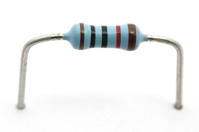
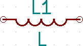
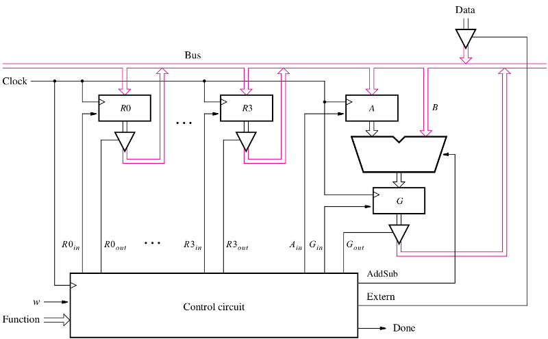
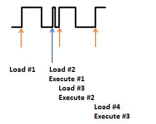

# Hacking hardware

Val di susa

---
class: center, middle
## Intro

---

class: center, middle
### Basic electronics

---

#### Corrente, voltaggio e potenza

Ci sono due grandezze fondamentali

 - **Ampere:** numero di cariche (elettroni) in unità di tempo che passano
in una sezione di un conduttore.
 - **Volt:** è l'energia necessaria a spostare una carica fra i capi di un filo

Nella pratica il voltaggio è sempre una differenza fra due valori (per questo
gli strumenti hanno due sonde); proprio perché si necessitano due valori,
uno viene chiamato **terra** (**ground**) e
indicato come GND, non tutti i GND nascono uguali! se due circuiti devono comunicare
**i loro segnali di terra devono essere collegati**.

**Se un apparecchiatura ha un filo che è segnalato come terra, DEVE ESSERE
COLLEGATO A TERRA** fare altrimenti è a vostro rischio e pericolo.

**Fare molta attenzione quando si connettono due dispositivi che abbiano
i voltaggi fra loro compatibili.**

Si chiama **Alternata** la corrente/voltaggio che varia nel tempo (**AC**) e **Continua** (**DC**)
quella costante. Tenere presente che le componenti si comportano diversamente in questi due regimi.

La potenza misurata in **Watt** invece è data da `\(P = IV\)`.

---

#### Segnale

In particolare un voltaggio che cambia con il tempo in una _maniera
particolare_ è chiamato **segnale**.

Il segnale _più puro_ è un'onda sinusoidale la cui formula è `\(V = A\,\sin\left(2\pi f t + \phi\right)\)`;
ogni segnale può essere scomposto in una somma di queste onde (per chi capisce di matematica
è la **trasformata di fourier**). Un'onda è descritta dalla sua ampiezza e fase.

.center[]

Per avere un confronto fra ampiezze di segnali si usano i **decibel** `\(dB = 10 \log_{10}{P_1\over P_2} = 20\log_{10}{A_1\over A_2}\)`.
valori importanti da tenere a mente: a `\(3 dB\)` la potenza è dimezzata (notare i grafici dei filtri più
avanti))

Altri tipi di onde sono **quadra**, **triangolare**, **dente di sega** etc...

---

#### Resistenza

È la componente più comune di un circuito: si misura in **Ohm** e permette di definire
la legge omonima (più grande R, più piccola la corrente):

$$
I = {V\over R}
$$

Come si nota se `\(R\to0\)` `\(I\to\infty\)` in tal caso si ha un **corto circuito**. Corto circuito
è male: il fumo che esce dalle componenti è dovuto (anche) a quello.

Le resistenze (ma non solo) hanno un valore di potenza massima ammessa, superato quella
prendono fuoco! Grazie a questo possono essere usate resistenza a zero ohm come
fusibili di emergenza. Altrimenti usare un [termistore](https://it.wikipedia.org/wiki/Termistore)
che ha la resistenza che aumenta con la temperatura.

.center[]

---

##### Pull-up/pull-down e voltage divider

.center[]

Per il voltage divider la formula del voltaggio nel punto centrale è data da
`\(V_{out} = {R_b\over R_a + R_b}\)VCC`; tenere presente che se l'uscita è
collegata ad un carico il voltaggio non rimane a quel valore.
---

#### Condensatore

Idealmente è costituito da due piastre parallele con del dielettrico in mezzo.
.center[]
Applicando un voltaggio ai capi si ottiene l'immagazzinamento di una carica (e di energia).

L'unità di misura è il **Farad**.

Notare come una volta carichi non facciano più passare corrente, quindi in DC
sono come un circuito aperto per quel ramo; invece in AC si comportano
come un corto circuito.

La sua _formula_ è `\(I=C{dV\over dt}\)`: in pratica la corrente che passa è data dalla
variazione in unità di tempo del voltaggio ai suoi estremi.

A parte l'utilizzo nei circuiti AC come filtri, essi vengono utilizzati per
**Decoupling/Bypass:** fornire una riserva di energia per carichi di energia improvvisa
(posti di solito tra VCC e GND ;))

---

#### Condensatori + resistenza = filtri

Il valore `\(RC\)` ha la dimensione di tempo (cioè secondi).

##### Filtro passa basso

##### Filtro passa alto

---

#### Induttanza

Questo è l'elemento più particolare di quelli lineari: immagazzina energia nel campo magnetico.
.center[]

La sua unità di misura è **Henry**.

La sua formula è `\(V = L{dI\over dt}\)`: il voltaggio ai suoi estremi è dato dalla
variazione della corrente che scorre in esso.

Ricordarsi che ogni elemento non è solo induttanza, condensatore e resistenza,
ma contiene un poco di ognuno.

Gli elementi di cui abbiamo parlato fino ad adesso sono elementi **lineari**,
cioé date le risposte di un circuito rispetto a due segnali, sommando
le risposte si ottiene la risposta del circuito a cui viene sottoposto
il segnale somma dei segnali iniziali.

---

#### Induttanza bonus

Una piccola cosa che si può fare con questo elemento è **aumentare** il voltaggio:
questo circuito genera un voltaggio di uscita doppio rispetto a quello di ingresso!

.center[]

Seguendo la **volt/second balance rule** si ha `\(<V> = 0 \)` perciò `\((V_O - V_I) + (0 - V_I) = 0\)`.

Ricordatevi che l'energia si deve conservare ;)

---

#### Induttanza e condensatori = filtri

Un filtro molto usato nei circuiti è il **tank LC**: è un passbanda
(la resistenza è aggiunta per evitare di far andare a `\(\infty\)`
il diagramma).

.center[]

.center[]

Qui `\(\sqrt{LC}\)` ha la dimensione di tempo.

---

#### Impedenza

La legge di Ohm vale solo per corrente continua, per la corrente alternata si usa una
grandezza più _complicata_ (non è una costante, è una funzione in campo complesso
che dipende dalla frequenze **nei circuiti lineari**). Le impedenze dal punto di vista
matematico sono:

`\(Z_R = R\quad Z_C = j{1\over \omega C}\quad Z_L = j\omega L\)`

Siccome la _parte reale_ è solo resistiva, induttanze e capacitanze
non consumano energia!

---

#### Diodi e led

Primo elemento non lineare e **drogato**; in pratica (con dei limiti)
fa passare la corrente solo in una direzione

.center[]

L'**anodo** è 0.6 Volt più positivo del **catodo**. **forward drop voltage**,
negli **zener** invece agisce anche in direzione opposta con un determinato
voltage drop quindi è usato in parti di circuito dove è necessaria una precisa
differenza di voltaggio.

Nella pratica li si trovano anche nei circuiti induttivi (per esempio motori elettrici)
per evitare picchi di corrente dovuti ad auto-induzione.

---

#### Voltage regulator

Sono circuiti che regolano il voltaggio ad un determinato livello. Ce ne sono
di diverse tipologie

 
##### Lineari

Possono solo diminuire il voltaggio originale e sono meno efficienti: un esempio
pacco è quello sotto con un semplice diodo

.center[]

---

#### Voltage regulator bis

##### Switching

Si basano sul _trucchetto_ delle induttanza e quindi possono anche aumentare il
voltaggio originale; sono più efficienti ma rumorosi (il voltaggio contiene delle
piccole variazioni dovute allo switching).

Ce ne sono di due tipologie

  - **Buck:** abbassano
  - **Boost:** alzano

##### Trasformatori

.center[]

---

#### Transistor

Componente rivoluzionaria, detto a cazzo è uno **interrutore elettrico** (molto
più veloce, piccolo e senza parti mobili rispetto ad un relay). La sua importanza
è anche nel fatto che amplifica e utilizzato con il feedback permette di costruire
circuiti particolari. Per esempio i voltage regulator lineari sono costruiti
usando il feedback di un transistor per mantenere il più possibile costante
il voltaggio in uscita.

.center[]

Ne esistono di diversi tipi **BJT**, **JFET** e **MOSFET**: i primi lavorano
in corrente e hanno un alto **gain**, i secondi lavorano in voltaggio, hanno
una più alta impedenza di ingresso ma hanno poco gain, per di più instabile.

Una componete che meriterebbe un talk a parte è l'**OpAmp**, praticamente
un transistor on steroid.

È il primo livello di astrazione che porta ai processori.

---

#### Logic gates

##### Livelli logici

Solitamente un voltaggio pari al VCC è logico 1 e GND è valore logico 0
(è possibile anche l'inverso) comunque un dispositivo non emette mai
un segnale ad un valore fisso, quindi esistono dei range.

I voltaggi dei livelli logici possono essere 5V, 3V3, 1V8. Avere un
voltaggio più basso significa avere meno consumo ma è in relazione
alle dimensioni dei transistor (motivo per cui 5V **distrugge** 3V3). 

##### Logica

Il livello successivo sono le porte logiche: implementazioni hardware
di operatori logici

.center[]

---

#### LG implementati con transistor

.center[]

---

#### LG combinatori e sequenziali e buffer

Normalmente l'unione di quest porte è detto **combinatorio**: 

.center[]

In certi casi è necessario avere dei circuiti con _memoria_;
tali circuiti sono detti **sequenziali**. Il core di questi circuiti
sono i **latch**, circuiti bistabili che permettono di immagazzinare
singoli bit.

.center[]

---

#### Cristalli&Clock

Come abbiamo visto con i Flip-Flop essi agiscono con un clock, cioé un segnale
ripetuto che deve essere il più regolare possibile.

Esistono vari circuiti che possono generare un segnale ciclico (555, colpitts oscillator)
ma per un motivo o per l'altro sono poco precisi (vuoi margine di errore delle componenti,
vuoi parametri operativi come temperatura).

In natura il quarto è un materiale piezoelettrico e permette di ottenere clock molto precisi
(parti per millione).

---

#### Flip-flop

È il nucleo dei circuiti digitali sequenziali; in questi circuiti il valore di output **Q** viene _salvato_
qualunque valore assume l'input **D**. **Q** viene aggiornato solo ad un ciclo
di clock con il valore di **Q**.

.center[]
.center[]

 - [What is a flip flop?](https://electronics.stackexchange.com/questions/251642/what-is-a-flip-flop)

---

#### Processori

.center[]

---

class: center, middle
### Utensili

---

#### Multimetro

---

#### Breadboard

.center[]

---

#### Piastra millefori

.center[]

---

#### Saldatore

Per costruire circuiti pensati per _sopravvivere_ si usano di solito
il saldatore e lo stagno: in pratica si porta lo stagno alla liquefazione
per usarlo come materiale di connessione fra la componente e il filo (o
l'oggetto che si vuole connettere).

.center[]

Lo stagno può contenere piombo (**Lead solder**), non contenerlo (**Lead free**),
oppure avere una componente di flussante (**Flux-core solder**).

[RoHS](https://en.wikipedia.org/wiki/Restriction_of_Hazardous_Substances_Directive)
[Video](video/solder-wick.mp4)
[Collin's Lab: Soldering](https://www.youtube.com/watch?v=QKbJxytERvg)
[Collin's Lab - Surface Mount Soldering](https://www.youtube.com/watch?v=QzoPxvIM2qE)

---
#### Oscilloscopio

Strumento fondamentale se ci si interessa a circuiti in AC e segnali in generale.

I parametri fondamentali per l'acquisto sono **bandwidth** e **# samples**

È possibile anche leggere programmaticamente da essi usando il protocollo [USBTMC](https://sigrok.org/wiki/USBTMC).

---

#### Logic analyzer

Viene utilizzato per _debuggare_ protocolli, il più famoso è della **Saleae**
che ha anche dei cloni cinesi che costano molto meno che funzionano con lo stesso
software chiamato [Logic](https://www.saleae.com/downloads).

.center[]

Non solo relativo ai logic analyzer, ma esiste il progetto [sigrok](https://www.sigrok.org)
per creare _ Free/Libre/Open-Source signal analysis software suite_.
---

class: center, middle
### Protocolli

---

#### Pulse Width Modulation (PWM)

È la cosa più semplice che vi può venire in mente: frequenza fissa e un duty cicle
variabile.

.center[]
---

#### UART (seriale)

Il modo di comunicare degli antichi (/dev/tty anyone?). Si chiama _seriale_
perché la comunicazione avviene un byte alla volta.

Solitamente usa 2 segnali + GND, è il modo più semplice per avere
un protocollo duplex senza un segnale di clock (condiviso); unico difetto è
che bisogna mettersi d'accordo su il **baud rate**.

Di solito è la prima cosa che uno controlla su un device perché è molto
semplice da trovare, da accedere e in molti casi dà accesso ad una shell
(anche con privilegi).

##### Segnali

 - TX
 - RX
 - DTS (opzionale)
 - CTS (opzionale)

---

#### Uart bis

##### Nexus 5

La seriale è accessibile dal jack audio (TSSR), i segnali sono (dalla punta)

 - TX  (giallo)
 - RX  (arancione)
 - GND (nero)
 - MIC (rosso)

quando MIC riceve 3V3 si attiva la console del kernel (mettere una resistenza di 100 Ohm 
fra MIC e 3V3, just in case).

 - [A better audio jack console cable for Google Nexus devices](http://www.pabr.org/consolejack/consolejack.en.html)

---

#### Uart tris

##### Samsung Galaxy S

Nel caso di questi device il micro USB può essere usato per accedere alla seriale as well

 - D- --> TX
 - D+ --> RX
 - ID --> resistenza con GND (150 kOhm)
 - GND
 - VCC

[Multiplexed Wired Attack Surfaces](https://greatscottgadgets.com/infiltrate2013/)

---

#### JTAG

In pratica un protocollo per debuggare dispositivi: permette di fare il single
step sui processori, analizzare la memoria, accedere e agire su flash memory e quant'altro.

Il momento che la trovi è game over per il dispositivo.

Il programma standard per interfacciarsi con questo protocollo è [OpenOCD](http://openocd.org).

##### Segnali

 - TMS
 - TCK
 - TDI
 - TDO
 - TRST (opzionale) Tap reset
 - SRST (opzionale) system reset

##### Links

 - [JTAGEnum](https://github.com/cyphunk/JTAGenum/)
 - [Locating JTAG pins automatically](http://elinux.org/images/d/d6/Jtag.pdf)
 - [The JTAG Interface: AN ATTACKER’S PERSPECTIVE](https://optivstorage.blob.core.windows.net/web/file/55e86eae3f04450d9bafcbb3a94559ca/JTAG.Whitepaper.pdf)

---

#### PS/2

Protocollo usato nelle vecchie tastiere e mouse.

 1. ``DATA``
 2. ``NC``
 3. ``GND``
 4. ``VCC``
 5. ``CLK``
 6. ``NC``

Consiste di 11 bit: 1 start bit low, 8 data bit, 1 parity bit and finally stop bit always high.
``DATA`` deve venire letta al falling edge di ``CLK``.

Funny enough se uno prende una tastiera ``USB``, essa funziona con questo 
protocollo se si usa ``D+`` come ``CLK`` e ``D-`` come ``DATA``.

---

class: center, middle
### Hacking

---

class: center, middle
#### Prototipazione

---

##### Circuiti stampati

I circuiti stampati che vedete nelle apparecchiature elettroniche
sono dette PCB ed esistono programmi che permettono di progettarle
(dei CAD)

 - Eagle proprietario della Autodesk, lo standard de facto
 - KiCAD open source sviluppato al CERN

Generalmente il design viene inviato ad una
 **Fab** dove le possono stampare; [Seeedstudio](https://www.seeedstudio.com/fusion_pcb.html) (cinese)
ne fa 10 per 10€ circa. È necessario produrre dei file in formato **Gerbers**
facendo attenzione che le specifiche (distanza fra le tracce, larghezza delle tracce,
etc...) siano compatibili con la precisione delle macchine.

Se siete per un approccio DIY potete usare un CNC oppure potete creare circuiti **Manhattan style**

.center[]

---

#### Circuit packages

.center[]

---

class: center, middle
#### Attacchi fisici

---

##### Side channel

Qualuque dispositivo fisico ha degli _input_ che non sono
intensi come canale di comunicazione (si pensi al clock e
all'alimentazione), ma che per la loro natura fisica
possono _tradire_ informazioni.

Il primo(?) esempio storico è la [Telescrivente](https://arstechnica.com/security/2015/10/how-soviets-used-ibm-selectric-keyloggers-to-spy-on-us-diplomats/)
nell'ambasciata americana: nascosta in una sua barra di metallo interna che
registrava il movimento del meccanismo e inviava all'esterno l'informazione.

Le categorie di questo attacco sono:

 - cache
 - timing
 - power analysis
 - electromagnetic

---

##### Timing attack (demo)

Abbiamo un arduino con una seriale che chiede una password, inside usa
una strcmp() come si può vedere dal disassemblato:

    $ avr-objdump -d demo/timing/build-uno/timing.elf | \
        sed -n '/<strcmp>:/,/^$/p'
    00000856 <strcmp>:
     856:   fb 01           movw    r30, r22
     858:   dc 01           movw    r26, r24
     85a:   8d 91           ld      r24, X+
     85c:   01 90           ld      r0, Z+
     85e:   80 19           sub     r24, r0
     860:   01 10           cpse    r0, r1
     862:   d9 f3           breq    .-10            ; 0x85a <strcmp+0x4>
     864:   99 0b           sbc     r25, r25
     866:   08 95           ret

**r1 è usato come registro fisso che continene zero!** ([source](https://gcc.gnu.org/wiki/avr-gcc#Fixed_Registers))

L'idea è che un 1MHz vuol dire 1us, ci sono 4 istruzioni in più che
vengono eseguite per qui 4*cicli clock -> 4us.

 - [Instruction set summary](extras/Instruction%20Set%20Summary.pdf)

---

##### Power analysis attack (demo)

Per la natura dei transistor succede che la transazione di valore
nei registri (ma non solo) causa picchi di consumo che possono essere
misurati e analizzati

**ATTENTI AI GROUND LOOP**

 - [Power-Based Side-Channel Attack for AES Key Extraction on the ATMega328 Microcontroller](https://skoppula.github.io/pdfs/sidechannel-report.pdf)
 - [Extracting the Private Key from a TREZOR](http://johoe.mooo.com/trezor-power-analysis/)

---

##### Fault injection (demo)

I flip-flop ideali si comportano come descritto precedentemente,
ma ovviamente nella realtà ci sono dei vincoli da rispettare
per evitare che si comportino secondo specifica.

In questa demo verrà usato un clock da 1MHz generato autonomamente
tramite una FPGA che può (per un singolo ciclo) diventare molto
più breve, risultando nel salto di una istruzione.

.center[]

Esiste anche il glitching dell'alimentazione!

 - https://www.blackhat.com/docs/eu-16/materials/eu-16-Timmers-Bypassing-Secure-Boot-Using-Fault-Injection.pdf (pg 82)
 - [estratto video di scanlime](video/scanlime-extract.mp4)

---

##### Reversing

 - [CSCI 4974 / 6974 Hardware Reverse Engineering](http://security.cs.rpi.edu/courses/hwre-spring2014/)
 - [The Layman's Guide to IC Reverse Engineering](http://siliconzoo.org/tutorial.html)
 - [NMOS IC Reverse Engineering](https://www.wdj-consulting.com/blog/nmos-sample.html)

---

### Link utili

 - https://www.youtube.com/user/devttys0/
 - https://www.youtube.com/user/Afrotechmods
 - https://www.youtube.com/user/eaterbc
 - https://www.youtube.com/user/colinpoflynn/
 - https://www.youtube.com/user/micahjd/
 - https://wiki.newae.com/ e https://app.assembla.com/spaces/chipwhisperer/git/source/master
 - http://www.electronicaestudio.com/docs/Hantek6022BE_Manual.pdf
 - https://en.wikipedia.org/wiki/Unlooper
 - https://rheingoldheavy.com/category/education/fundamentals/arduino-from-scratch-series/

---

### Extra

.center[]
